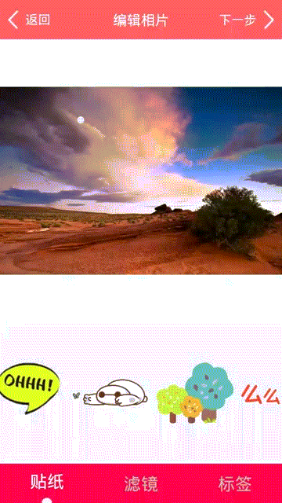
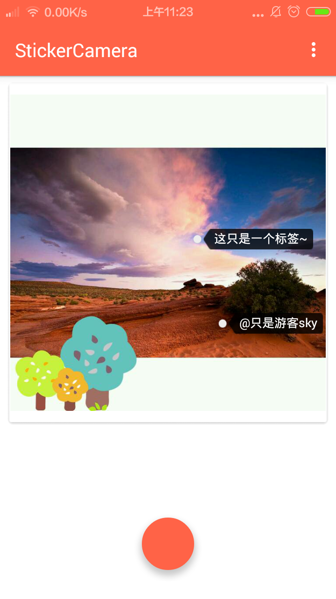
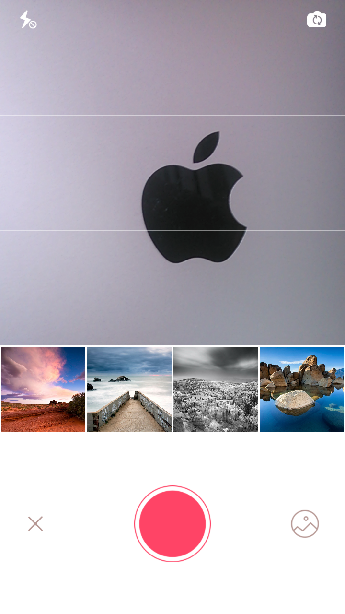
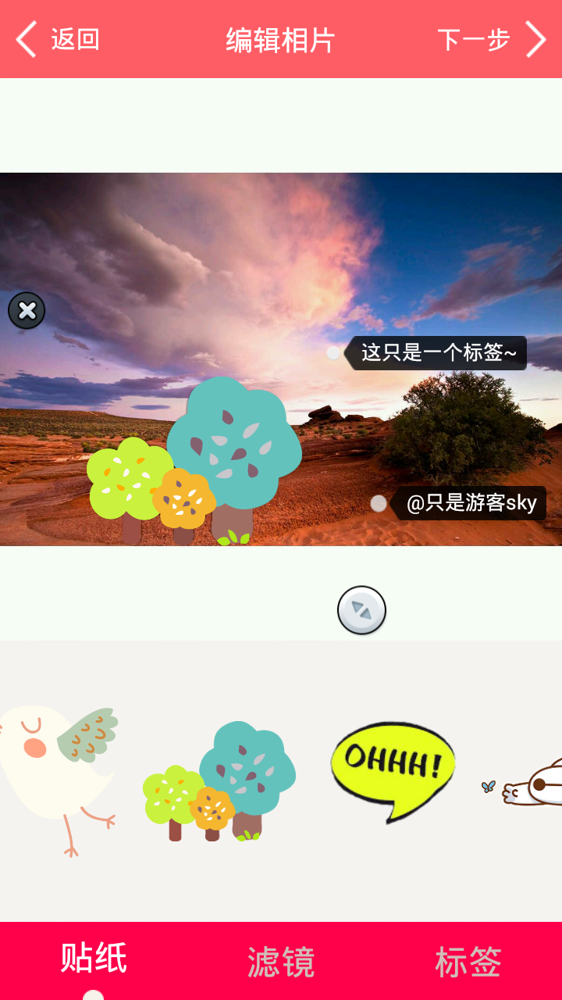
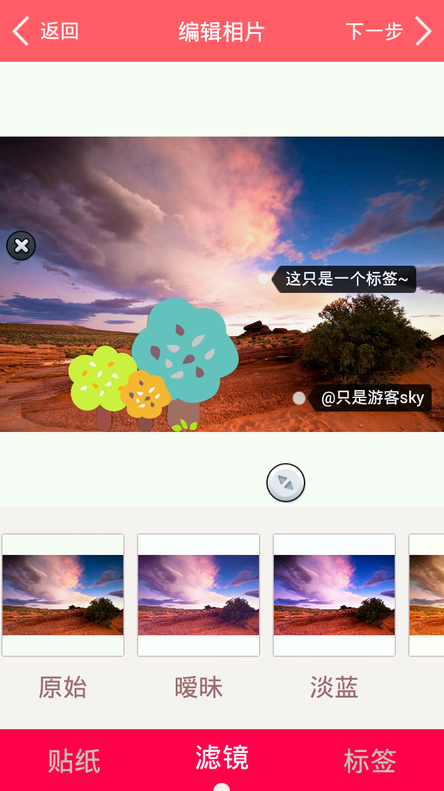

# StickerCamera

This is an Android application with camera,picture cropping,collage sticking and tagging.

这是一款集成了相机,图片裁剪,给图片贴贴图打标签的APP。

# Feature

- Achieve the function of camera.
- Achieve the function of photo cropping.
- Achieve the function of photo filter.
- Can stick collage on photo (collage can be moved,enlarged, and rotated).
- Can tag in pictures(also can be moved).
- Save the completed pictures locally, show more custom views and better framework.


- 实现相机功能
- 实现对图片进行裁剪的功能
- 图片的滤镜功能
- 能为图片添加贴纸(贴纸可移动,放大,旋转)
- 能为图片添加标签(同样可以移动)
- 本地保存制作好的图片,并展示
- 较多的自定义控件,不错的项目架构


  (Translation powered by Amy)

# ScreenShot











# Thanks

- [Gpu-image](https://github.com/CyberAgent/android-gpuimage)
- [Android-Universal-Image-Loader](https://github.com/nostra13/Android-Universal-Image-Loader)
- [ImageViewTouch](https://github.com/ojas-webonise/ImageViewTouch)
- [butterknife](https://github.com/JakeWharton/butterknife)
- [Notes](https://github.com/lguipeng/Notes)
- [SystemBarTint](https://github.com/jgilfelt/SystemBarTint)
- [cropimage](https://github.com/biokys/cropimage)
- [EventBus](https://github.com/greenrobot/EventBus)
- [Aviary-Android-SDK](https://github.com/kitek/Aviary-Android-SDK)
- [fastjson](https://github.com/alibaba/fastjson)
- [PagerSlidingTabStrip](https://github.com/astuetz/PagerSlidingTabStrip)
- [android-common](https://github.com/Trinea/android-common)


# Contributors

- [ouyezi](https://github.com/ouyezi)
- [Skykai521](https://github.com/Skykai521)

# Apk Demo
Change screenshot/StickerCamera.zip to StickerCamera.apk

# Contact Me

- Weibo: http://weibo.com/2030683111
- Email: 1132234509@qq.com

# License
```
Copyright 2015 DaQingkai

Licensed under the Apache License, Version 2.0 (the "License");
you may not use this file except in compliance with the License.
You may obtain a copy of the License at

    http://www.apache.org/licenses/LICENSE-2.0

Unless required by applicable law or agreed to in writing, software
distributed under the License is distributed on an "AS IS" BASIS,
WITHOUT WARRANTIES OR CONDITIONS OF ANY KIND, either express or implied.
See the License for the specific language governing permissions and
limitations under the License.
```
